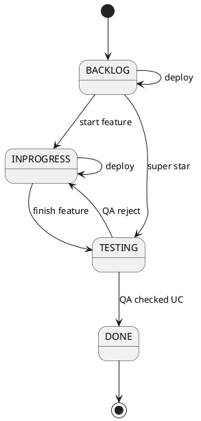

#### Разбор примера:
* https://github.com/antkorwin/statemachine
* https://antkorwin.com/statemachine/statemachine.html

```plantuml
@startuml

[*] --> BACKLOG

BACKLOG --> INPROGRESS : start feature

INPROGRESS --> TESTING : finish feature

TESTING -->DONE : QA checked UC

TESTING --> INPROGRESS : QA reject

DONE --> [*]

BACKLOG --> TESTING : super star

BACKLOG --> BACKLOG : deploy
INPROGRESS --> INPROGRESS : deploy
@enduml
```